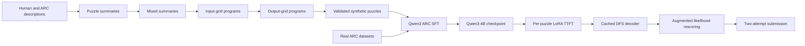
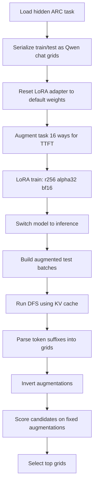

# NVARC

## Snapshot

| Field | Value |
|---|---|
| Official score | 27.5 in the ARC official table. NVARC's paper also reports 27.64 public leaderboard during the competition and a 29.72 post-deadline variant. |
| Team | Ivan Sorokin and Jean-Francois Puget, NVIDIA. |
| Public sources | [ARC table](https://arcprize.org/competitions/2025), [paper](https://drive.google.com/file/d/1vkEluaaJTzaZiJL69TkZovJUkPSDH5Xc/view), [GitHub](https://github.com/1ytic/NVARC), [Kaggle notebook](https://www.kaggle.com/code/sorokin/arc2-qwen3-unsloth-flash-lora-batch4-queue). |
| Model stack | Qwen3 4B bfloat16 checkpoint in the public notebook; paper also discusses Qwen3-VL-2B-Instruct LLM and Qwen3-4B-Thinking-2507 variants. LoRA TTFT via Unsloth. |
| Data stack | Multi-stage synthetic data generation from H-ARC, BARC descriptions, ARC-AGI-2 summaries, generated Python input/output programs, plus MINI-ARC, ConceptARC, RE-ARC, and real ARC-AGI-2 data for final pretraining mixes. |
| Runtime constraints | Kaggle submission budget: 12 hours, 4 L4 GPUs, no internet. Paper says competition online stage required models up to 4B and a simple workflow; offline 4B full fine-tuning used multi-node H100 resources. |

## Architecture

## Inference And Training Loop

## Review Tables

### Architectural Bet

| Question | Review |
|---|---|
| Core bet | A high-quality synthetic puzzle corpus can teach a small Qwen3 model a broad ARC prior, then per-task LoRA and efficient search can specialize it. |
| Why it fit ARC-AGI-2 | ARC-AGI-2 hidden tasks are novel enough that public-task memorization fails, but task-local train examples expose the rule when the model has useful priors. |
| Evidence | Paper and code. The paper presents synthetic generation as the core idea; the notebook shows Qwen3 4B, LoRA TTFT, DFS, and rescoring. |
| Risk | Synthetic summaries and generated programs can leak, overfit, or teach artifacts. The paper also reports rerun variability and mixed TRM ensemble results. |

### Learned Representation

| Component | Review |
|---|---|
| Grid format | Qwen chat format with `<|im_start|>user` for input grids and `<|im_start|>assistant` for outputs. Rows are digit strings separated by newlines. |
| Token set | Public code narrows ARC output search to digits, newline, user/assistant markers, pad, and end tokens. |
| Output shape | Autoregressive output is constrained by parsing and valid-grid checks; no separate shape model is visible in the notebook. |
| Representation strength | Very compact for ARC color grids, and compatible with Qwen chat pretraining. |
| Representation weakness | Still left-to-right, so shape and early row mistakes can cascade unless DFS/search recovers. |

### Training And Test-Time Adaptation

| Stage | Review |
|---|---|
| Offline training | Paper reports full fine-tuning Qwen3 with NeMo RL/Megatron and sequence packing on 3.2M augmented samples. |
| Synthetic data | Four-stage SDG: collect/summarize descriptions, mix summaries, generate input-grid programs, generate output-grid programs, filter for consistency. |
| TTFT | Public notebook trains a LoRA adapter per puzzle, with rank 256, alpha 32, `bf16=True`, `load_in_4bit=False`, and gradient checkpointing disabled. |
| Optimizer | Public notebook uses `adamw_torch`, learning rate `5e-5`, cosine schedule, one epoch, batch size 1, and gradient accumulation 1. |
| Reset behavior | Public notebook saves default PEFT weights and reloads them before each puzzle. |

### Candidate Generation And Scoring

| Component | Review |
|---|---|
| Candidate generation | DFS over allowed ARC output tokens; candidates below a negative-log-likelihood threshold are expanded. |
| KV cache | `inference_turbo_dfs` primes the prefix once and passes `past_key_values` recursively through DFS expansion. |
| Augmentation | Test-time train and inference apply transpose, rotations, random color permutations, and train-example shuffling. |
| Rescoring | Paper reports fixed eight-augmentation likelihood rescoring; notebook computes augmented scores for candidate grids and then selects by scoring functions. |
| Final selection | Decoder aggregates decoded result files and emits the top two attempts per test item. |

### Attention/KV/Activation/Gradient Choices

| Area | Visible choice |
|---|---|
| Attention | Qwen autoregressive attention with cache during DFS; paper mentions Flash Attention 2 with Unsloth for TTFT. |
| KV cache | Public code uses `use_cache=True` and recursive `past_key_values` in DFS. |
| Activations | Public notebook uses bf16 checkpoint weights and converts float32 parameters to bf16 after PEFT wrapping. |
| Gradients | LoRA-only online training; no gradient checkpointing in the public TTFT args. |
| Quantization | Public notebook sets `load_in_4bit=False` for TTFT/inference; paper says 4-bit quantization was removed for TTFT. |
| Batch determinism | Paper reports a batch-invariant inference attempt using Thinking Machines code, but it was slower and not used in the final submission. |

### Strengths, Failure Modes, And Open Questions

| Category | Review |
|---|---|
| Strength | Best official score; strongest evidence that validated synthetic puzzle programs can transfer to ARC-AGI-2. |
| Strength | Search engineering is concrete and efficient: cached DFS, constrained tokens, augmented rescoring. |
| Failure mode | Rerun variability of 1-2 points reported in the paper. |
| Failure mode | TRM ensemble was hard to tune and sometimes scored below Qwen3 alone. |
| Open question | How much of the gain comes from synthetic program quality versus Qwen3 representation and DFS? |
| Open question | Can TRM or another non-LLM solver contribute candidates that Qwen scoring will reliably select? |

## Evidence Ledger

| Claim | Evidence type | Source |
|---|---|---|
| Official score is 27.5. | writeup | ARC official results table. |
| Paper reports 27.64 public and 29.72 post-deadline variant. | paper | NVARC paper. |
| Core idea is synthetic ARC-AGI task generation. | paper | NVARC paper. |
| Public notebook uses Qwen3 4B bfloat16 model source. | code | NVARC Kaggle notebook metadata and code. |
| TTFT uses LoRA rank 256 and alpha 32. | code | NVARC Kaggle notebook. |
| TTFT uses bf16 and disables 4-bit quantization and gradient checkpointing. | code | NVARC Kaggle notebook; paper agrees. |
| DFS uses KV cache. | code | `turbo_dfs` and `inference_turbo_dfs` in notebook. |
| Batch-invariant inference was tested but not final because it was slower. | paper | NVARC paper. |
| TRM had potential but was not final winning path. | paper | NVARC paper. |
| Hidden-set behavior beyond official score is unknown. | inference | Private test details are not public. |
