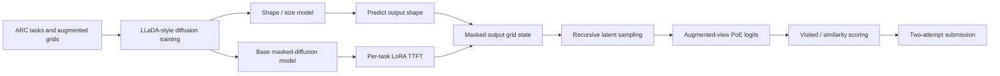
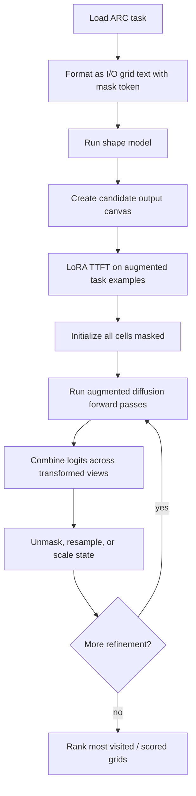

# ARChitects

## Snapshot

| Field | Value |
|---|---|
| Official score | 17.5 in the ARC official table. |
| Team | The ARChitects: Daniel Franzen, Jan Disselhoff, and collaborators credited in the team writeup/notebook. |
| Public sources | [ARC table](https://arcprize.org/competitions/2025), [team writeup](https://lambdalabsml.github.io/ARC2025_Solution_by_the_ARChitects/), [Kaggle notebook](https://www.kaggle.com/code/gregkamradt/arc-2025-diffusion), 2024 lineage paper ["Boosting performance on ARC is a matter of perspective"](https://arxiv.org/abs/2505.11860). |
| Model stack | LLaDA-style masked diffusion checkpoints, including a base model and a size/shape model in the public notebook. |
| Data stack | ARC-AGI data plus the team's offline ARC diffusion training setup; writeup reports unsuccessful synthetic-data attempts and a pivot toward masked diffusion. |
| Runtime constraints | Public notebook uses offline packages, no internet, four worker processes, bf16 loads, activation checkpointing, and 4-bit model artifacts. |

## Architecture

## Inference And Training Loop

## Review Tables

### Architectural Bet

| Question | Review |
|---|---|
| Core bet | ARC output generation benefits from masked, whole-grid diffusion rather than purely left-to-right decoding. |
| Why it fit ARC-AGI-2 | Many ARC transformations are spatial and global; diffusion can revise arbitrary cells instead of committing to token order. |
| Evidence | Team writeup describes the 2025 LLaDA/masked-diffusion pivot; public notebook implements mask-token grid inference. |
| Risk | Diffusion inference adds iterative compute and shape-dependence, and scoring candidates is less standard than language-model beam likelihood. |

### Learned Representation

| Component | Review |
|---|---|
| Grid format | Text format with input marker `I`, output marker `O`, border/pad tokens, digits, and a dedicated `<|mdm_mask|>` token. |
| Output shape | Separate size model predicts output shapes before masked-grid inference. |
| Latent state | Public code stores a grid-shaped state with 10 color channels plus a mask channel. |
| Representation strength | Whole-grid masked state lets the model update uncertain cells without left-to-right exposure bias. |
| Representation weakness | Shape prediction errors can prevent inference or lead to skipped tasks; output grid state adds custom scoring machinery. |

### Training And Test-Time Adaptation

| Stage | Review |
|---|---|
| Offline training | Team writeup reports the 2025 trained diffusion models; public notebook loads two LLaDA mix checkpoints. |
| Synthetic data | Team writeup reports failed or unhelpful synthetic-data attempts, so the final bet was model/paradigm shift rather than NVARC-style SDG. |
| TTFT | Public notebook builds a LoRA adapter with rank 64, alpha 16, dropout 0, and target modules including attention, feed-forward, and embedding-related layers. |
| Optimizer | Public notebook uses bitsandbytes `AdamW8bit`, non-embedding lr `5e-5`, embedding lr `5e-6`, cosine schedule, and Accelerate bf16. |
| Augmentation | TTFT data is augmented by geometric transforms, rotations/transposes, color permutations, and shuffled examples. |

### Candidate Generation And Scoring

| Component | Review |
|---|---|
| Candidate generation | Iterative masked diffusion: initialize unknown grid, run forward passes, sample/scale logits, reset uncertain positions, and accumulate visited states. |
| Shape gate | Size model confidence chooses shapes for inference; tasks are sorted by confidence and length. |
| Augmented views | Public code transforms the current state, runs model logits, inverts transforms, and averages logits as a product-of-experts-like signal. |
| Scoring | Public code tracks most visited grids and also computes cosine similarity and hinge-like scores from logits. |
| Final selection | Top visited/scored grids become attempt 1 and attempt 2. |

### Attention/KV/Activation/Gradient Choices

| Area | Visible choice |
|---|---|
| Attention | Masked-diffusion forward passes via `AutoModel`, bf16, `flash_attention=True`. |
| KV cache | No autoregressive KV-cache DFS is visible; the model recomputes masked states during iterative diffusion. |
| Activations | Public code sets LLaDA activation checkpointing to `one_in_two`; whole-layer checkpointing is present as a commented alternative. |
| Gradients | LoRA TTFT with Accelerate bf16 and explicit backward/optimizer loop. |
| Quantization | Kaggle model artifacts are named 4-bit; runtime loads bf16 model objects. |
| Memory controls | Activation checkpointing, compressed collator, single-task TTFT blocks, and 4 worker scheduling. |

### Strengths, Failure Modes, And Open Questions

| Category | Review |
|---|---|
| Strength | Strongest non-NVARC official result and a distinct generation paradigm. |
| Strength | Explicit output-shape model and whole-grid refinement address common ARC failure modes. |
| Failure mode | Shape prediction becomes a hard dependency; wrong shapes are hard to recover. |
| Failure mode | Iterative diffusion is compute-heavy under Kaggle time limits. |
| Open question | Could NVARC-scale synthetic data improve this diffusion stack if generated in the right format? |
| Open question | Can diffusion candidate scores be calibrated better against autoregressive likelihoods or external verifiers? |

## Evidence Ledger

| Claim | Evidence type | Source |
|---|---|---|
| Official score is 17.5. | writeup | ARC official results table. |
| 2025 solution pivots to masked diffusion/LLaDA. | writeup | ARChitects team writeup. |
| Public notebook loads LLaDA mix base and size models. | code | ARChitects Kaggle notebook. |
| Separate shape prediction precedes inference. | code | `detect_shape` path in notebook. |
| TTFT uses LoRA rank 64 and AdamW8bit. | code | `ttt_model` in notebook. |
| Runtime uses bf16 and activation checkpointing. | code | Notebook model load and checkpointing setup. |
| Synthetic-data attempts were not the final successful path. | writeup | ARChitects team writeup. |
| No cached DFS-style KV path is visible. | inference | Public code uses masked-diffusion forward passes, not autoregressive DFS. |
