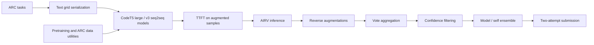
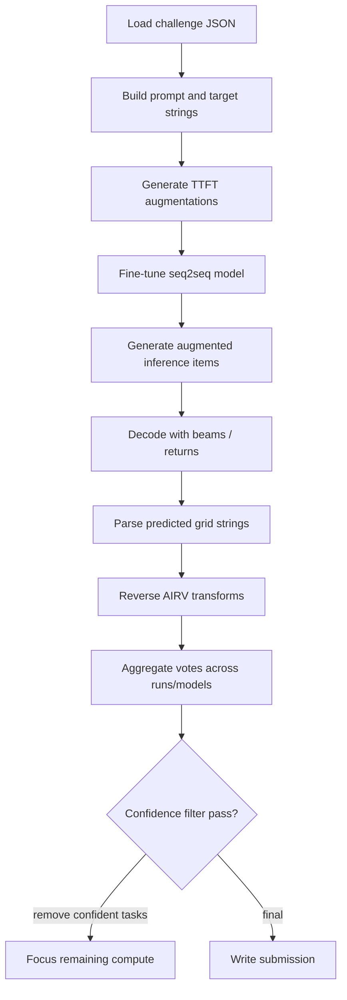

# MindsAI

## Snapshot

| Field | Value |
|---|---|
| Official score | 14.2 in the ARC official table. |
| Team | MindsAI / Tufa Labs: Jack Cole, Dries Smit, Isaiah Pressman, Mohamed Osman, Michael Hodel. |
| Public sources | [ARC table](https://arcprize.org/competitions/2025), [Kaggle notebook](https://www.kaggle.com/code/gregkamradt/mindsai-tufa-2025-v4), [solution-code dataset](https://www.kaggle.com/datasets/jcole75/arc2025-solution-code), [background paper](https://arxiv.org/abs/2506.14276). |
| Model stack | 2025 notebook sets `MODEL_CONFIG_MODULES=codet5_large,codet5_large_v3` and uses Kaggle datasets `codet5-large` and `codet5-large-v3`. Treat this as CodeT5 / Salesforce CodeT5-style seq2seq for the submitted stack. |
| Data stack | ARC-1.5 JSON, ARC Prize 2025 challenges, solution-code dataset, CodeT5 model datasets, and internal pretraining/augmentation utilities in the public code archive. |
| Runtime constraints | Public notebook metadata is no-internet and no-GPU; wrapper sets `TOTAL_TIME_HOURS=12`, `GLOBAL_TTT_SAMPLES=40000`, and `GLOBAL_INF_SAMPLES=10000`. Source code supports GPU, TPU/Flax, bf16, gradient checkpointing, and distributed execution. |

## Architecture

## Inference And Training Loop

## Review Tables

### Architectural Bet

| Question | Review |
|---|---|
| Core bet | A seq2seq model can learn an ARC-specific text grid representation and be strengthened by TTFT, AIRV, tokenizer dropout, focal loss, and ensembles. |
| Why it fit ARC-AGI-2 | Seq2seq training naturally maps train/test prompts to output grids and can exploit augmentation-heavy supervised examples. |
| Evidence | 2025 notebook lists methods and CodeT5 configs; public solution-code dataset contains CodeT5 model configs and AIRV/TTFT docs. |
| Risk | Source conflict: the paper discusses LongT5 in broader ARC research, while the 2025 notebook uses CodeT5 modules. Runtime/accelerator details are less clear than for NVARC or ARChitects. |

### Learned Representation

| Component | Review |
|---|---|
| Grid format | Prompt strings such as `solve: train input1 ... output1 ... test tinput1 ... toutput1`; targets include length/height/width/symbol metadata and row strings. |
| Model type | CodeT5-style seq2seq with encoder input and decoder target. |
| Tokenization | Configs enable token filtering and tokenizer dropout: training rate 0.2, inference rate 0.1 in visible CodeT5 configs. |
| Output shape | Shape is embedded in the target syntax; parser validates grid format and falls back on invalid outputs. |
| Representation weakness | Long prompts can exceed max lengths, so code trims examples and relies on compact serialization. |

### Training And Test-Time Adaptation

| Stage | Review |
|---|---|
| Offline training | Public archive includes pretraining loaders, RE-ARC pretraining options, scaling utilities, and model configs. Exact final offline checkpoint recipe is not fully reconstructed from public sources. |
| TTFT | CodeT5 configs enable `ttt_enabled`, use one epoch, gradient accumulation 16, bf16, gradient checkpointing, and target TTFT sample budgets from environment variables. |
| Loss | Visible CodeT5 configs use focal loss settings, label smoothing 0, eos weight, and position weighting options. |
| Mini LR search | Notebook lists Mini Grid LR Search as a method; public code exposes `mini_lr_grid` blocks and orchestration. Whether a given pulled config has it enabled is version-dependent and should be checked before reproducing. |
| LoRA | Public model configs expose LoRA blocks but CodeT5 large/v3 visible configs have LoRA disabled by default, indicating full/standard seq2seq fine-tuning unless overridden. |

### Candidate Generation And Scoring

| Component | Review |
|---|---|
| Candidate generation | Seq2seq beam generation with multiple returned sequences, augmented inference samples, and optional diverse beam settings. |
| AIRV | Augment, run inference, reverse augmentation, and vote. Public technical docs explicitly describe this flow. |
| Ensemble | Supports model ensemble and self-ensemble; notebook lists model ensembling as a method. |
| Confidence filtering | Public docs describe progressive filtering after model/self-ensemble cycles using vote counts, z-score thresholds, and ambiguous strong agreement. |
| Final selection | Aggregated valid grids are converted to the ARC two-attempt submission format. |

### Attention/KV/Activation/Gradient Choices

| Area | Visible choice |
|---|---|
| Attention | Standard seq2seq transformer attention through Hugging Face/CodeT5; no custom KV-cache search path is visible. |
| KV cache | Generation may use framework-level decoder caching, but no explicit DFS cache engineering is visible in public docs. |
| Activations | CodeT5 configs use bf16 and gradient checkpointing; source supports mixed precision and TPU/Flax paths. |
| Gradients | Gradient accumulation 16 in visible CodeT5 configs; optional optimizer choices include AdamW, Muon, and Adafactor via environment. |
| Quantization | CodeT5 large/v3 configs are not primarily 4-bit; other model configs in the archive include quantization paths. |
| Memory controls | Max input 2900, max target/generation 600 in visible CodeT5 configs; OOM reduction/min batch controls exist. |

### Strengths, Failure Modes, And Open Questions

| Category | Review |
|---|---|
| Strength | Strongest top-five seq2seq system and a mature ARC-specific framework with TTFT, AIRV, ensembling, and analysis tooling. |
| Strength | Confidence filtering is a pragmatic way to spend compute on unresolved tasks. |
| Failure mode | Public source conflict around LongT5 vs CodeT5 can confuse reproduction. |
| Failure mode | Exact final model weights and runtime accelerator behavior are less transparent than notebook-level configs. |
| Open question | How much of the score comes from CodeT5 representation versus AIRV/voting/scoring? |
| Open question | Would the framework benefit from NVARC-style executable synthetic data while preserving CodeT5 syntax? |

## Evidence Ledger

| Claim | Evidence type | Source |
|---|---|---|
| Official score is 14.2. | writeup | ARC official results table. |
| Team members are Jack Cole, Dries Smit, Isaiah Pressman, Mohamed Osman, Michael Hodel. | code | Public Kaggle notebook and solution-code README. |
| 2025 notebook uses `codet5_large,codet5_large_v3`. | code | Kaggle notebook environment cell. |
| Notebook lists TTFT, AIRV, model ensembling, mini grid LR search, tokenizer dropout, and focal loss. | code | Kaggle notebook markdown. |
| Public CodeT5 configs use tokenizer dropout, focal loss, bf16, gradient checkpointing, and gradient accumulation. | code | Solution-code dataset configs. |
| Paper discusses LongT5. | paper | arXiv background paper. |
| The submitted 2025 stack should be labeled CodeT5-style, not LongT5, unless a newer primary source contradicts it. | inference | Code evidence is later and specific to the 2025 notebook. |
| Exact hidden-set runtime behavior is unclear. | inference | Public wrapper metadata and code capabilities do not fully expose competition execution details. |
