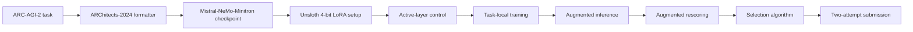
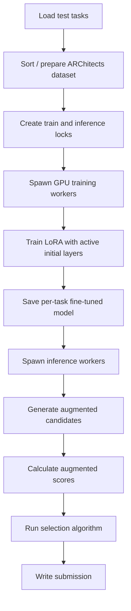

# Lonnie

## Snapshot

| Field | Value |
|---|---|
| Official score | 5.83 in the ARC official table. |
| Team | Lonnie / Lonnie Qin. |
| Public sources | [ARC table](https://arcprize.org/competitions/2025), [Kaggle notebook](https://www.kaggle.com/code/lonnieqin/lb-5-83-baseline-from-1st-place-of-2024), original 2024 ARChitects baseline notebook linked from the public notebook. |
| Model stack | 2024 ARChitects autoregressive baseline adapted to ARC-AGI-2, using `wb55l_nemomini_fulleval`, a Mistral-NeMo-Minitron-family checkpoint, loaded through Unsloth 4-bit. |
| Data stack | ARC Prize 2025 challenge data, 2024 ARChitects utilities, `dfranzen/unsloth-2024-9-post4`, and the `wb55l_nemomini_fulleval` model artifact. |
| Runtime constraints | Public notebook metadata: Nvidia L4 GPU enabled, no internet. Code assumes 4 GPUs and launches training and inference subprocesses. |

## Architecture

## Inference And Training Loop

## Review Tables

### Architectural Bet

| Question | Review |
|---|---|
| Core bet | The 2024 winning ARChitects autoregressive baseline retains enough ARC signal for ARC-AGI-2 if the online adaptation is tuned for L4 limits. |
| Why it fit ARC-AGI-2 | It reuses a proven ARC-specific format, LoRA training path, and augmentation/scoring stack instead of building a new solver. |
| Evidence | Public notebook states it is forked from the 2024 first-place baseline and lists active-layer control plus tuned LoRA/training settings. |
| Risk | The notebook itself reports large discrepancy between public evaluation and semi-private runs, with unknown cause. |

### Learned Representation

| Component | Review |
|---|---|
| Grid format | ARChitects-2024 `ArcFormatter_premix_3` style text representation. |
| Model type | Autoregressive causal LM via Mistral-NeMo-Minitron-family checkpoint. |
| Output shape | Handled by the inherited decoder/parser and augmented scoring machinery. |
| Representation strength | Reuses a format already proven on ARC Prize 2024. |
| Representation weakness | ARC-AGI-2 tasks are harder and distribution-shifted; the inherited representation may not encode new abstractions as well as newer systems. |

### Training And Test-Time Adaptation

| Stage | Review |
|---|---|
| Offline training | No new large offline training is visible; the system starts from the public 2024-derived checkpoint. |
| TTFT | Per-task LoRA training through Unsloth 4-bit, using task augmentations and train-example shuffling. |
| Active layers | Notebook adds `num_active_layers=32`, activating only the first layers while freezing the rest during training. |
| Optimizer | Visible training args use `adamw_8bit`, learning rate `1e-4` for training and `5e-5` for retraining path, with embedding learning rates lower or zero. |
| Sequence lengths | Visible config uses `max_seq_length_train=4224` and `max_seq_length_infer=8192`. |

### Candidate Generation And Scoring

| Component | Review |
|---|---|
| Candidate generation | Inherited ARChitects autoregressive inference with augmentation and decoder storage. |
| Augmentation | Uses `rnd_all` color permutations, rotations/transposes, train-example shuffling, and augmented inference. |
| Rescoring | `use_aug_score=True`; final code calculates augmented scores before selection. |
| Selection | Uses `score_full_probmul_3` when augmented scoring is enabled. |
| Reported variance | Notebook reports about 115 on public ARC-AGI-2 evaluation set and semi-private scores `[4.17, 5, 5, 5.42, 5.83]`, with the discrepancy unknown. |

### Attention/KV/Activation/Gradient Choices

| Area | Visible choice |
|---|---|
| Attention | Autoregressive transformer loaded through Unsloth; flash attention and gradient checkpointing options are inherited from the model runner. |
| KV cache | Inference likely uses the inherited decoder's causal LM generation path; no custom NVARC-style DFS cache implementation is introduced. |
| Activations | Unsloth 4-bit loading and gradient checkpointing are enabled in the LoRA setup. |
| Gradients | LoRA target modules include attention projections, MLP projections, embeddings, and LM head. Active-layer control freezes later layers. |
| Quantization | `mode='unsloth_4bit'` is used for base model loading. |
| Scheduling | Notebook launches multiple train and inference subprocesses, with GPU slot coordination. |

### Strengths, Failure Modes, And Open Questions

| Category | Review |
|---|---|
| Strength | Simple, focused adaptation of a known ARC-2024 system. |
| Strength | Active-layer control directly addresses memory/time constraints. |
| Failure mode | Semi-private variance is high and unexplained in the source. |
| Failure mode | Reused baseline lacks NVARC-scale data or ARChitects-2025 diffusion improvements. |
| Open question | Does active-layer control improve generalization or mainly make the run fit the budget? |
| Open question | Which tasks account for the public/semi-private discrepancy? |

## Evidence Ledger

| Claim | Evidence type | Source |
|---|---|---|
| Official score is 5.83. | writeup | ARC official results table. |
| Notebook is forked from 2024 first-place baseline. | code | Lonnie notebook markdown. |
| Active-layer control trains initial Mistral-NeMo-Minitron layers and freezes the rest. | code | Lonnie notebook markdown and `prepare_model` changes. |
| Uses Unsloth 4-bit and LoRA target modules. | code | Lonnie notebook code. |
| Uses `num_active_layers=32`. | code | Lonnie notebook code. |
| Uses augmented scoring and `score_full_probmul_3`. | code | Lonnie notebook code. |
| Public/local versus semi-private discrepancy is unknown. | code | Lonnie notebook markdown. |
| Exact causal effect of active-layer control is not established. | inference | No ablation is provided in the public notebook. |
