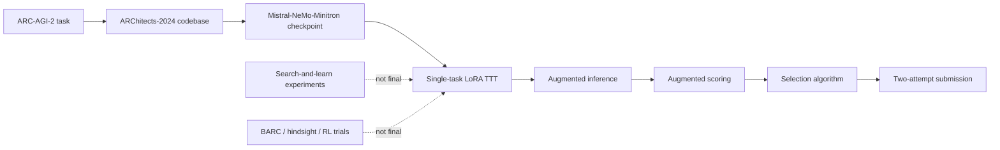
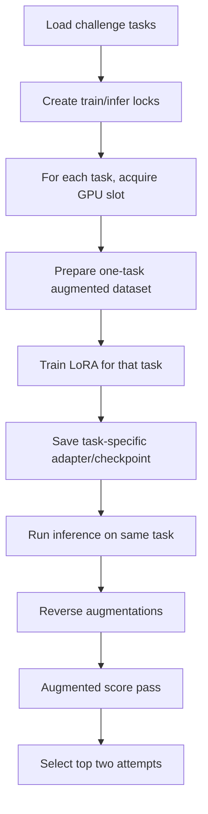

# G. Barbadillo

## Snapshot

| Field | Value |
|---|---|
| Official score | 5.0 in the ARC official table. |
| Team | Guillermo Barbadillo. |
| Public sources | [ARC table](https://arcprize.org/competitions/2025), [solution summary](https://ironbar.github.io/arc25/05_Solution_Summary/), [Kaggle notebook](https://www.kaggle.com/code/ironbar/the-architects-single-task-ttt). |
| Model stack | Single-task TTT adaptation of the 2024 ARChitects autoregressive stack using `wb55l_nemomini_fulleval`, Unsloth 4-bit, and LoRA. |
| Data stack | ARC Prize 2025 challenge data, `ironbar/the-architects` code dataset, `dfranzen/unsloth-2024-9-post4`, and 2024 ARChitects model artifacts. Blog also discusses BARC induction, hindsight relabeling, and RL/refinement experiments. |
| Runtime constraints | Public notebook metadata: Nvidia L4 GPU enabled, no internet. Notebook assumes 4 GPUs, copies model to shared memory, and coordinates train/inference workers. |

## Architecture

## Inference And Training Loop

## Review Tables

### Architectural Bet

| Question | Review |
|---|---|
| Core bet | A robust single-task TTT version of the 2024 ARChitects stack was more competition-ready than broader search-and-learn or RL experiments. |
| Why it fit ARC-AGI-2 | ARC tasks provide few-shot examples; training on one task at a time maximizes specialization and avoids cross-task interference. |
| Evidence | Notebook markdown says it applies TTT to each task individually and tunes for 4 GPUs; blog explains why final submission prioritized robust TTT. |
| Risk | Single-task TTT is compute-expensive and inherits limitations of the 2024 model/representation. |

### Learned Representation

| Component | Review |
|---|---|
| Grid format | Inherited ARChitects formatter (`ArcFormatter_premix_3`) with color/geometric augmentation. |
| Model type | Autoregressive causal LM from the Mistral-NeMo-Minitron-family `wb55l_nemomini_fulleval` checkpoint. |
| Output shape | Handled by inherited parser/decoder and validation rather than a separate 2025 shape model. |
| Representation strength | Proven baseline with mature decoder and augmentation infrastructure. |
| Representation weakness | Does not include the ARChitects-2025 diffusion representation or NVARC-style compact Qwen chat-grid representation. |

### Training And Test-Time Adaptation

| Stage | Review |
|---|---|
| Offline training | No new large offline training in the final notebook; it uses the existing ARChitects model artifact. |
| TTFT | Single-task training; each task gets its own LoRA update before inference. |
| LoRA | Visible config uses rank 4, alpha 16, dropout 0, target modules across attention, MLP, embeddings, and LM head. |
| Optimizer | `adamw_8bit`, learning rate `2e-4`, embedding learning rate `2e-5`, one epoch, warmup ratio 0.1. |
| Sequence lengths | Both train and inference max sequence lengths are set to 8192 in the public notebook. |

### Candidate Generation And Scoring

| Component | Review |
|---|---|
| Candidate generation | Inherited ARChitects autoregressive inference after task-specific LoRA training. |
| Augmentation | Uses rotations/transposes, color permutations, train-example shuffling, and one inference augmentation per task configuration. |
| Rescoring | `use_aug_score=True`; augmented scoring uses the same transform family and `score_full_probmul_3`. |
| Search-and-learn | Blog discusses search-and-learn framing and experiments, but these are not the final notebook path. |
| Final selection | Decoder loads stored inference outputs, applies augmented scoring, and writes two attempts. |

### Attention/KV/Activation/Gradient Choices

| Area | Visible choice |
|---|---|
| Attention | Autoregressive transformer loaded through Unsloth. |
| KV cache | No new custom cached DFS path is visible; generation/search is inherited from the ARChitects-2024 codebase. |
| Activations | Unsloth 4-bit mode with gradient checkpointing enabled in LoRA setup. |
| Gradients | LoRA-only task training, gradient accumulation 1, warmup ratio 0.1, AdamW 8-bit optimizer. |
| Quantization | `mode='unsloth_4bit'` for base model loading. |
| Scheduling | 4 GPUs, two train slots per GPU, three inference slots per GPU, file locks for task scheduling. |

### Strengths, Failure Modes, And Open Questions

| Category | Review |
|---|---|
| Strength | Clear, robust final submission path after broad experimentation. |
| Strength | Single-task TTT directly targets each hidden task and avoids group-level dilution. |
| Failure mode | Final model family is less modern than NVARC and ARChitects-2025 diffusion. |
| Failure mode | Search-and-learn, BARC, hindsight relabeling, RL, and refinement ideas were not mature enough for final score impact. |
| Open question | Which experiments would improve if paired with NVARC-style synthetic data or a stronger scorer? |
| Open question | Can single-task TTT be made faster enough to run more candidate searches per task? |

## Evidence Ledger

| Claim | Evidence type | Source |
|---|---|---|
| Official score is 5.0. | writeup | ARC official results table. |
| Final notebook applies TTT to each task individually. | code | Kaggle notebook markdown and code. |
| Notebook is modified to work efficiently on 4 GPUs. | code | Kaggle notebook markdown and worker scheduling code. |
| Uses `wb55l_nemomini_fulleval` and Unsloth 4-bit. | code | Kaggle notebook metadata and code. |
| Uses LoRA rank 4 and learning rate `2e-4`. | code | Kaggle notebook config. |
| Blog discusses BARC induction, hindsight relabeling, RL/refinement, and search-and-learn framing. | writeup | Barbadillo solution summary. |
| Final submission prioritized robust TTT. | writeup | Barbadillo solution summary plus final notebook. |
| Exact ablation contribution of each discarded experiment is incomplete. | inference | Blog is explanatory but not a full controlled ablation report. |
